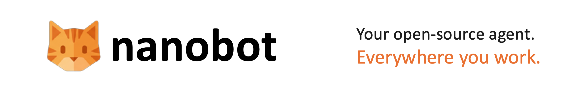
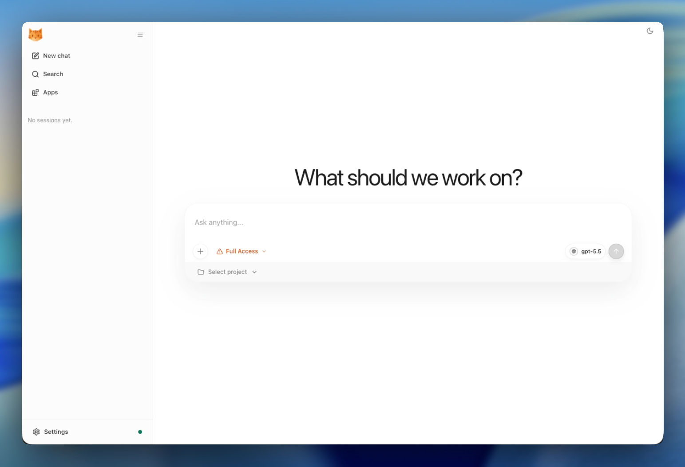

<picture>
  <source media="(prefers-color-scheme: dark)" srcset="./images/readme-cover-dark.png">
  
</picture>

<div align="center">
  <p>
    <a href="https://nanobot.wiki/docs/latest/getting-started/nanobot-overview">English</a> |
    <a href="https://nanobot.wiki/cn/docs/latest/getting-started/nanobot-overview">简体中文</a> |
    <a href="https://nanobot.wiki/zh-Hant/docs/latest/getting-started/nanobot-overview">繁體中文</a> |
    <a href="https://nanobot.wiki/es/docs/latest/getting-started/nanobot-overview">Español</a> |
    <a href="https://nanobot.wiki/fr/docs/latest/getting-started/nanobot-overview">Français</a> |
    <a href="https://nanobot.wiki/id/docs/latest/getting-started/nanobot-overview">Bahasa Indonesia</a> |
    <a href="https://nanobot.wiki/ja/docs/latest/getting-started/nanobot-overview">日本語</a> |
    <a href="https://nanobot.wiki/ko/docs/latest/getting-started/nanobot-overview">한국어</a> |
    <a href="https://nanobot.wiki/ru/docs/latest/getting-started/nanobot-overview">Русский</a> |
    <a href="https://nanobot.wiki/vi/docs/latest/getting-started/nanobot-overview">Tiếng Việt</a>
  </p>
  <p>
    <a href="https://pypi.org/project/nanobot-ai/"></a>
    <a href="https://pepy.tech/project/nanobot-ai"></a>
    
    
    <a href="https://github.com/HKUDS/nanobot/graphs/commit-activity" target="_blank">
        </a>
    <a href="https://github.com/HKUDS/nanobot/issues?q=is%3Aissue%20is%3Aclosed" target="_blank">
        </a>
    <a href="https://twitter.com/intent/follow?screen_name=nanobot_project" target="_blank">
        </a>
    <a href="https://nanobot.wiki/docs/latest/getting-started/nanobot-overview"></a>
    <a href="./COMMUNICATION.md"></a>
    <a href="./COMMUNICATION.md"></a>
    <a href="https://discord.gg/MnCvHqpUGB"></a>
  </p>
</div>

🐈 **nanobot** is an open-source, ultra-lightweight personal AI agent you can truly own. It keeps the agent core small and readable while giving you the practical pieces for real long-running work: WebUI, chat channels, tools, memory, MCP, model routing, automation, and deployment.

## Start Here

| You want to... | Go to |
|---|---|
| Install nanobot with no terminal/config background | [Start Without Technical Background](./docs/start-without-technical-background.md) |
| Install quickly and get one CLI reply | [Install](#-install) and [Quick Start](#-quick-start) |
| Open the bundled browser UI | [WebUI](#-webui) |
| Connect Telegram, Discord, WeChat, Slack, Email, Mattermost, or another chat app | [Chat Apps](./docs/chat-apps.md) |
| Configure providers, fallback models, Langfuse, MCP, web tools, or security | [Docs](./docs/README.md) and [Configuration](./docs/configuration.md) |
| Understand or extend the internals | [Architecture](./docs/architecture.md) and [Development](./docs/development.md) |

## What can nanobot do?

nanobot is a self-hosted personal AI agent runtime. It can:

- run in a browser WebUI or terminal
- connect to Telegram, Discord, Slack, WeChat, Email, Mattermost, and other chat apps
- use tools such as files, shell, web search, web fetch, MCP, cron, image generation, and subagents
- keep session history and long-term memory through Dream
- run long-horizon goals and scheduled automations
- expose a Python SDK and OpenAI-compatible API for integrations
- deploy as a long-running local or server-side agent gateway

## Latest Release

**v0.2.2 - Durability Release**

Highlights:

- Segmented WebUI transcripts
- Python SDK runtime controls
- Automation management
- Search/STT provider improvements
- Gateway/session/provider reliability

[See full changelog](https://github.com/HKUDS/nanobot/releases/tag/v0.2.2)

## Open Source Partners

<p align="center">
  <a href="https://platform.kimi.com?aff=nanobot"><picture><source media="(prefers-color-scheme: dark)" srcset="https://kimi-file.moonshot.cn/prod-chat-kimi/kfs/4/1/2026-06-05/1d8h69mt3v89kkekg24gg"></picture></a>
  <a href="https://platform.minimaxi.com/subscribe/token-plan?code=GILTJpMTqZ&source=link"></a>
</p>

## Recent Updates

- **2026-06-21** Python SDK runtime controls, optional Keenable key, cleaner run hooks.
- **2026-06-20** Telegram rich messages, safer SDK concurrency, smoother Quick Start.
- **2026-06-19** Firecrawl app, OpenAI image edits, safer session deletion.
- **2026-06-18** Feishu recovery, Keenable search, Mistral polish, workspace-aware git.
- **2026-06-17** Default idle auto-compact, clearer `/dream`, macOS installer fixes.

For older updates, see the [release archive](./docs/release-archive.md) or [GitHub releases](https://github.com/HKUDS/nanobot/releases).

## 💡 Why nanobot

- **Persistent workflows**: goals, memory, tools, and chat context survive long-running work.
- **Chat-native reach**: WebUI, API, Telegram, Feishu, Slack, Discord, Teams, email, and Mattermost.
- **Model freedom**: OpenAI-compatible APIs, local LLMs, image generation, search, and fallbacks.
- **Small core**: readable internals with MCP, memory, deployment, and automation built in.
- **Own your stack**: inspect, customize, self-host, and extend without a giant platform.

## 📦 Install

> [!IMPORTANT]
> If you want the newest features and experiments, install from source. 
> 
> If you want the most stable day-to-day experience, install from PyPI or with `uv`.

Pick **one** install method:

Prerequisites: Python 3.11 or newer. Git is only needed for a source install; Node.js/Bun are only needed if you are developing the WebUI itself.

If terminals, API keys, or config files are new to you, use the guided zero-background walkthrough in [Start Without Technical Background](./docs/start-without-technical-background.md) instead of this compact README path.

**One-command setup**

macOS / Linux:

```bash
curl -fsSL https://raw.githubusercontent.com/HKUDS/nanobot/main/scripts/install.sh | sh
```

Windows PowerShell:

```powershell
irm https://raw.githubusercontent.com/HKUDS/nanobot/main/scripts/install.ps1 | iex
```

The default command installs or upgrades `nanobot-ai` from PyPI, then starts `nanobot onboard --wizard`. It avoids system-wide pip installs by using an active virtual environment, `uv`, `pipx`, or a managed venv under `~/.nanobot/venv`. If Quick Start finishes, skip the manual initialize/configure steps below and go straight to **Open the WebUI**.

To preview the plan without changing your environment, pass `--dry-run`; combine it with `--dev` when you want to preview the main-branch install.

```bash
curl -fsSL https://raw.githubusercontent.com/HKUDS/nanobot/main/scripts/install.sh | sh -s -- --dry-run
```

```powershell
& ([scriptblock]::Create((irm https://raw.githubusercontent.com/HKUDS/nanobot/main/scripts/install.ps1))) --dry-run
```

To install the current `main` branch instead, pass `--dev`:

```bash
curl -fsSL https://raw.githubusercontent.com/HKUDS/nanobot/main/scripts/install.sh | sh -s -- --dev
```

```powershell
& ([scriptblock]::Create((irm https://raw.githubusercontent.com/HKUDS/nanobot/main/scripts/install.ps1))) --dev
```

If you prefer to inspect the script first, open [`scripts/install.sh`](./scripts/install.sh) or [`scripts/install.ps1`](./scripts/install.ps1).

**Install with `uv`**

```bash
uv tool install nanobot-ai
```

**Install from PyPI with pip**

```bash
python -m pip install nanobot-ai
```

If pip reports `externally-managed-environment` on macOS or Linux, use the one-command installer, `uv tool install nanobot-ai`, `pipx install nanobot-ai`, or install inside a virtual environment.

**Install from source**

```bash
git clone https://github.com/HKUDS/nanobot.git
cd nanobot
python -m pip install -e .
```

Verify the install:

```bash
nanobot --version
```

## 🚀 Quick Start

**1. Initialize**

Skip this step if the one-command setup already started the wizard and Quick Start finished there.

```bash
nanobot onboard
```

Use `nanobot onboard --wizard` if you prefer an interactive setup.

**2. Configure** (`~/.nanobot/config.json`)

Skip this step if you already configured provider and model settings in the wizard.

`nanobot onboard` creates `~/.nanobot/config.json` and `~/.nanobot/workspace/`. Configure these **two parts** in the config file. Add or merge the following blocks into the existing file instead of replacing the whole file.

The example below uses a generic OpenAI-compatible `custom` provider so the compact path does not recommend one hosted service. Provider examples are recipes, not rankings or endorsements. For copyable provider-specific setup, see [Provider Cookbook](./docs/provider-cookbook.md).

*Set your API key*:

```json
{
  "providers": {
    "custom": {
      "apiKey": "your-api-key",
      "apiBase": "https://api.example.com/v1"
    }
  }
}
```

*Set a model preset and make it active*:

```json
{
  "modelPresets": {
    "primary": {
      "label": "Primary",
      "provider": "custom",
      "model": "model-id-from-your-provider",
      "maxTokens": 8192,
      "contextWindowTokens": 200000,
      "temperature": 0.1
    }
  },
  "agents": {
    "defaults": {
      "modelPreset": "primary"
    }
  }
}
```

Direct `agents.defaults.provider` and `agents.defaults.model` still work for existing configs, but named presets are the recommended path because they also power `/model` switching and `fallbackModels`.

For another provider, the same config shape still applies:

| Replace | Where |
|---|---|
| Provider config key | `providers.<provider>` |
| API key | `providers.<provider>.apiKey` |
| Preset provider name | `modelPresets.primary.provider` |
| Model ID | `modelPresets.primary.model` |
| Endpoint URL, only when needed | `providers.<provider>.apiBase` |

**3. Open the WebUI**

Start the browser workbench:

```bash
nanobot webui
```

`nanobot webui` prepares the local WebSocket channel if needed, starts the gateway, and opens `http://127.0.0.1:8765`. It binds the first-run WebUI to `127.0.0.1` by default, so it is not exposed to your LAN. Prefer not to keep a terminal open? Use `nanobot webui --background`, then manage the gateway with `nanobot gateway status`, `logs`, `restart`, and `stop`.

For manual or terminal-only setup, test one CLI message:

```bash
nanobot status
nanobot agent -m "Hello!"
```

In `nanobot status`, it is normal for most providers to say `not set`. The active preset's provider should be configured, and `Config` plus `Workspace` should show check marks.

If that works, start an interactive chat:

```bash
nanobot agent
```

Need help with `PATH`, API keys, provider/model matching, or JSON errors? See the fuller [Install and Quick Start](./docs/quick-start.md) and [Troubleshooting](./docs/troubleshooting.md).

- Want a pasteable provider setup? See [Provider Cookbook](./docs/provider-cookbook.md)
- Want to understand provider/model matching? See [Providers and Models](./docs/providers.md)
- Want web search, MCP, security settings, or more config options? See [Configuration](./docs/configuration.md)
- Want to run locally? See [Ollama](./docs/providers.md#ollama), [vLLM or another local OpenAI-compatible server](./docs/providers.md#vllm-or-other-local-openai-compatible-server), and the full [provider reference](./docs/configuration.md#providers).
- Want to run nanobot in chat apps like Telegram, Discord, WeChat or Feishu? See [Chat Apps](./docs/chat-apps.md)
- Want Docker or Linux service deployment? See [Deployment](./docs/deployment.md)

## 🌐 WebUI

The WebUI ships **inside the published wheel** — no extra build step. It is the browser workbench for chat sessions, workspace controls, Apps, Skills, Automations, and settings. For the full user guide, see [`docs/webui.md`](./docs/webui.md).

<p align="center">
  
</p>

**Open it**

```bash
nanobot webui
```

The command enables the local WebSocket channel after confirmation, starts the gateway, and opens [`http://127.0.0.1:8765`](http://127.0.0.1:8765). To open it from another device on your LAN, see [WebUI docs -> LAN access](./docs/webui.md#lan-access).

The WebUI is served by the WebSocket channel on port `8765` by default. The gateway's `18790` port is for the health endpoint, not the browser UI.

> [!TIP]
> Working on the WebUI itself? Check out [`webui/README.md`](./webui/README.md) for the source-tree, Vite dev server, build, and test workflow.

## 🏗️ Architecture

<p align="center">
  
</p>

🐈 nanobot stays lightweight by centering everything around a small agent loop: messages come in from chat apps, the LLM decides when tools are needed, and memory or skills are pulled in only as context instead of becoming a heavy orchestration layer. That keeps the core path readable and easy to extend, while still letting you add channels, tools, memory, and deployment options without turning the system into a monolith.

## ✨ Features

<table align="center">
  <tr align="center">
    <th><p align="center">📈 24/7 Real-Time Market Analysis</p></th>
    <th><p align="center">🚀 Full-Stack Software Engineer</p></th>
    <th><p align="center">📅 Smart Daily Routine Manager</p></th>
    <th><p align="center">📚 Personal Knowledge Assistant</p></th>
  </tr>
  <tr>
    <td align="center"><p align="center"></p></td>
    <td align="center"><p align="center"></p></td>
    <td align="center"><p align="center"></p></td>
    <td align="center"><p align="center"></p></td>
  </tr>
  <tr>
    <td align="center">Discovery • Insights • Trends</td>
    <td align="center">Develop • Deploy • Scale</td>
    <td align="center">Schedule • Automate • Organize</td>
    <td align="center">Learn • Memory • Reasoning</td>
  </tr>
</table>

## 📚 Docs

Browse the [repo docs](./docs/README.md) for the latest features and GitHub development version, or visit [nanobot.wiki](https://nanobot.wiki/docs/latest/getting-started/nanobot-overview) for the stable release documentation.

- Use task-oriented guides: [Guides](./docs/guides/README.md)
- Start with no technical background: [Start Without Technical Background](./docs/start-without-technical-background.md)
- Start from zero with developer basics: [Install and Quick Start](./docs/quick-start.md)
- Understand the runtime model: [Concepts](./docs/concepts.md)
- Read the source-level map: [Architecture](./docs/architecture.md)
- Choose a provider/model: [Providers and Models](./docs/providers.md)
- Copy provider setup recipes: [Provider Cookbook](./docs/provider-cookbook.md)
- Debug setup and runtime failures: [Troubleshooting](./docs/troubleshooting.md)
- Talk to your nanobot with familiar chat apps: [Chat App AI Agent](./docs/guides/chat-app-ai-agent.md) · [Chat Apps](./docs/chat-apps.md)
- Configure providers, web search, MCP, and runtime behavior: [Configuration](./docs/configuration.md)
- Integrate nanobot with local tools and automations: [OpenAI-Compatible API](./docs/openai-api.md) · [Python SDK](./docs/python-sdk.md)
- Run nanobot with Docker or as a Linux service: [Deployment](./docs/deployment.md)

## 🤝 Contribute & Roadmap

PRs welcome! The codebase is intentionally small and readable. 🤗

### Contribution Flow

See [CONTRIBUTING.md](./CONTRIBUTING.md) for setup, review, and contribution guidelines.

**Roadmap** — Pick an item and [open a PR](https://github.com/HKUDS/nanobot/pulls)!

- **Multi-modal** — See and hear (images, voice, video)
- **Long-term memory** — Never forget important context
- **Better reasoning** — Multi-step planning and reflection
- **More integrations** — Calendar and more
- **Self-improvement** — Learn from feedback and mistakes

## Contact

This project was started by [Xubin Ren](https://github.com/re-bin) as a personal open-source project and continues to be maintained in an individual capacity using personal resources, with contributions from the open-source community. Feel free to contact [xubinrencs@gmail.com](mailto:xubinrencs@gmail.com) for questions, ideas, or collaboration.

### Contributors

<a href="https://github.com/HKUDS/nanobot/graphs/contributors">
  
</a>


## ⭐ Star History

<div align="center">
  <a href="https://star-history.com/#HKUDS/nanobot&Date">
    <picture>
      <source media="(prefers-color-scheme: dark)" srcset="https://api.star-history.com/svg?repos=HKUDS/nanobot&type=Date&theme=dark" />
      <source media="(prefers-color-scheme: light)" srcset="https://api.star-history.com/svg?repos=HKUDS/nanobot&type=Date" />
      
    </picture>
  </a>
</div>

<p align="center">
  <em> Thanks for visiting ✨ nanobot!</em><br><br>
  
</p>
